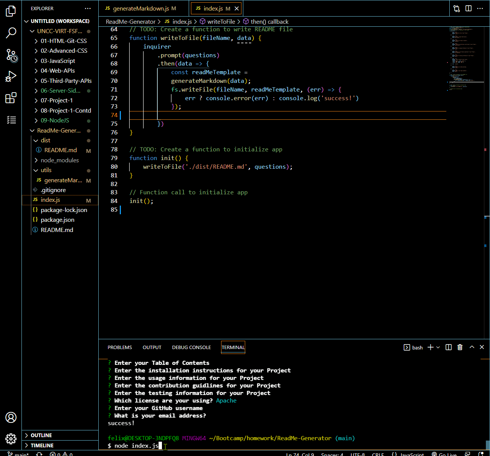

# README Generator

## Description
This Javascript program can be used to generate a custom readme for the end user. It takes in readme specific information through Terminal prompts and automatically generates the readme once all prompts have been completed. 

## Usage
This program is intended to quickly generate a readme based on information provided by the user.

## Visual Demonstration

## Technology
This program was created using JavaScript along with local Node NPM tools. The final product is a readme generated in a .md format within a desitined 'dist' folder. 

## Contributors
felix1805@gmail.com
Felix Petzsche

## Deployed Link

https://felix1805.github.io/ReadMe-Generator/

https://github.com/felix1805/ReadMe-Generator